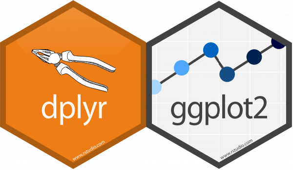
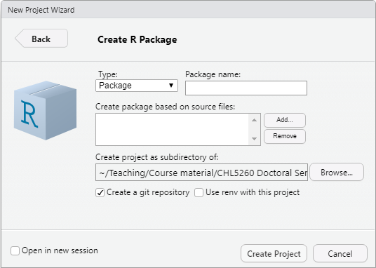
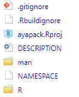
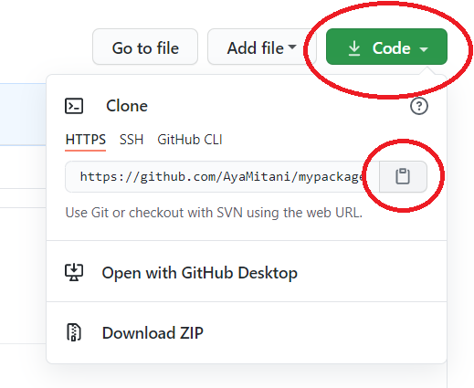
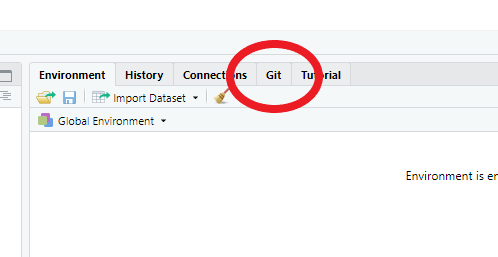
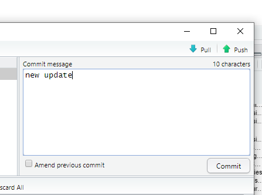

```{r setup, include=FALSE}
options(htmltools.dir.version = FALSE)
knitr::opts_chunk$set(
  #fig.width=9, fig.height=3.5, fig.retina=3,
  fig.retina = 3,
  #out.height = "100%",
  cache = FALSE,
  echo = TRUE,
  message = FALSE, 
  warning = FALSE,
  hiline = TRUE
)
library(available)
library(here)
library(devtools)
library(knitr)
library(tinytex)
library(usethis)
```

```{r xaringan-themer, include=FALSE, warning=FALSE}
library(xaringanthemer)
style_duo_accent(
  primary_color = "#002A5C",
  text_bold_color = "#008BB0",
  secondary_color = "#008BB0",
  inverse_header_color = "#FFFFFF"
)
```

## What is an R package?

- Collection of code, data, documentation developed by R community
- Addresses particular problem with specialized statistical technique, graphical device, etc. 
- Core set of packages come with base R
- $>15,000$ Additional packages available from CRAN, Bioconductor, Omegahat, GitHub, etc.
- Popular R packages 
  + `dplyr`
  + `ggplot2`


```{r, echo = FALSE, fig.align='center', out.width= 300}

```
---

## What is GitHub?

- Website that hosts software development and version control using Git
- Free basic services
- Truly open source
- "Facebook for programmers"

<div align="center">

</div>

---

## Why write an R package?

### For yourself
  + Save time 
    - Keep track of your functions
    - Have all your functions in one place
  + **Document** your work
  + For publishing papers
    - Increasingly, (bio)statistical journals ask for R package development of a novel method
    
### For others
  + If the package is useful to you, it is also useful to someone else
  + Readers of your paper can use the proposed method
  + Advance science!

---


## Why publish your package on GitHub?

- Reproducibility
- Accessibility
- Collaboration
- Back-up method
- Version-control using Git (more on this later)

---

## What do you need to write an R package?

- R Studio (https://rstudio.com/)
- Packages
  + `devtools` 
  + `roxygen2` 
  + `usethis` 
- Git (install from https://git-scm.com/)
- GitHub account (https://github.com/)
- `Rtools` package (https://cran.r-project.org/bin/windows/Rtools/)
  + Not necessary if you stick to base R and add-on packages on CRAN 
  + Good idea to install it eventually

#### Some other useful packages

- `here` 
- `available`

<div align="center">

</div>

---

## Major steps

1. Open R Studio
    * *New Project* > *New Directory* > *R Package* > Enter info > *Create Project*
2. Edit your package
    * Each function should be saved in its own file
    * Write the package description and document functions
    * Include some data 
    * Write a vignette 
3. Create a new repository in GitHub
    * Repo name $=$ package name
4. Connect to GitHub
5. Pull + Commit + Push
6. Use/share package with `install_github()`

**There is more than one way!**


---

## Naming your R package

### Some tips

* Make it simple & short
* Make it unique (use `available` package -- see next slide)
* Must start with a letter & cannot end with a period
* Do not use special characters
* Trend towards using all lower case
* Hadley's book has [more information](https://r-pkgs.org/workflow101.html#name-your-package)


---

## Naming R package

Check to see if the name is unique, especially if you plan to submit your package to CRAN.

```{r, eval = FALSE}
install.packages("available")
library(available)
available("ayapack", browse = FALSE)
```

---

## First step in RStudio

* New *Project* > *New Directory* > *R Package*
  - Enter "Package name"
  - Optional: Select R scripts that include your functions (if you leave it blank, a default function is included)
  - Select a subdirectory where you want to save the package (this location is not too important since the final product will be saved on GitHub)
  - Check "`Create a git repository`"

<div align="center">

</div>

---

## This will create the following files and folders

* **packagename.Rproj**: This indicates that the directory is a project
* **DESCRIPTION**: This is where all the meta-data about your package goes -- you can edit this file manually 
* **NAMESPACE**: This file indicates what needs to be exposed to users for your R package -- we will recreate this file using `document()` (see next slide)
* **R**: This is where all your R code goes for your package
* **man**: This is where the manuals for your functions will be saved
* Don't worry too much about the rest (.gitignore, .Rbuildingore)


<div align="center">

</div>


---

## Document using roxygen2

* Next, load the packages
```{r, eval = FALSE}
library(devtools)
library(usethis)
```

* Then, **delete** the NAMESPACE file
* If you don't already have R scripts, create them by `usethis::use_r()` and write the function
* Document your function by adding `roxygen2` comments (see next slide)
    + Comment lines begin with #’
    + Place comment lines directly above the function
    + Place @ tag after #’ to supply a specific section 
    + Untagged lines will be used to generate a title, description, and details section (in that order)

---

## Document using roxygen

```{r, eval = FALSE}
#' @title inverse logistic link function
#' @description a function that returns the inverse of the logistic link function
#' @param x numeric vector
#' @return y
#' @author Aya Mitani
#' @examples
#' expit(2)
#' @export

expit <- function(x){
  y <- exp(x) / (1 + exp(x))
  return(y)
}
```

---

## Document using roxygen

When you are finished with the comments, use `document()` to convert `roxygen2` comments into
documentation.

```{r, eval = FALSE}
devtools::document()
```

This will create 

* `myexpit.Rd` inside the `man` direcotory  
* `NAPESPACE`

Both are read only -- **NEVER edit these files by hand!**

View the help file 
```{r, eval = FALSE}
?myexpit
```

---

## Edit the DESCRIPTION file

### Your package information

The DESCRIPTION file is pre-generated by `roxygen2`.

```{r, eval = FALSE}
Package: ayapack
Type: Package
Title: What the Package Does (Title Case)
Version: 0.1.0
Author: Who wrote it
Maintainer: The package maintainer <yourself@somewhere.net>
Description: More about what it does (maybe more than one line)
    Use four spaces when indenting paragraphs within the Description.
License: What license is it under?
Encoding: UTF-8
LazyData: true
RoxygenNote: 7.1.1
```

You **can** edit the `DESCRIPTION` file by hand


---

## Edit the DESCRIPTION file

### Dependencies 

If your package **depends** on other packages or you want to **suggest** other packages, then include them in the DESCRIPTION file.

For example, if you require `survival` and suggest `ggplot2`, then
```{r, eval = FALSE}
usethis::use_package("survival")
usethis::use_package("ggplot2", "suggests")
```
will add `survival` under `Imports` and `ggplot2` under `Suggests`
```{r, eval = FALSE}
Imports: 
    survival
Suggests: 
    ggplot2
```

---

## Licensing

I'm not a lawyer so read [this](https://r-pkgs.org/license.html) to learn more about licensing. I just use the code below...

```{r, eval = FALSE}
usethis::use_mit_license()
```


---

## Include data sets

**Example data sets** are very useful for demonstrating your functions

* Create a subdirectory `data/` 
* Import existing data or generate your own data

```{r, eval = FALSE}
# I like to use the here package to locate my files
library(here)
toydata <- read.table(here("toydata.txt"), header = TRUE)
# Alternatively, you can specify the exact location to your file by writing out the full path
```

* Save with `.rda` extension in `data/` 
```{r, eval = FALSE}
usethis::use_data(toydata)
```

---

## Describe your data

Every data set should come with a description

* Create a `.R` file and add `roxygen2` comments
* Write the name of the data at the end (see next slide)
* Save the file in `R/` subdirectory with the name `toydata.R`
* `devtools::document()` to convert the comments to documentation
* See the documentation by `?toydata`

---

## Describe your data

### Quick example

```{r, eval = FALSE}
#' Example data
#'
#' Data from a toxicology study blah blah blah
#'
#' @docType data
#' @format A data frame with 1028 rows and 4 variables:
#' \describe{
#'   \item{LitID}{Litter ID}
#'   \item{Dose}{Dose of ethylene glycol (EG) administered}
#'   \item{FetalWt}{Fetal weight}
#'   \item{FetalMal}{Indicator for fetal malformation}
#' }
#' @source https://content.sph.harvard.edu/fitzmaur/ala2e/
#' @references Price, C.J., Kimmel, C.A., Tyl, R.W. and Marr, M.C. (1985).
#' The developmental toxicity of ethylene glycol in rats and mice.
#' Toxicological Applications in Pharmacology, 81, 113-127.
"exampledata" 
```

---

## Test the functions in your package

- You also want the "tests" that you run for your function to be reproducible
- Let's automate the testing procedure
- [More on testing](https://r-pkgs.org/testing-basics.html)

```{r, eval = FALSE}
install.package("testthat")
library(testthat)
```

The code below will create a new folder called `tests` that contain an R script named `testthat.R` and another folder called `testthat`.

```{r, eval = FALSE}
usethis::use_testthat()
```

The code below will create a new R script called `test-myexpit.R` for testing the function `myexpit`.

```{r, eval = FALSE}
usethis::use_test("myexpit")
```


---
## Test the functions in your package

The code below will test whether the function `expit` will return the correct value 0.5 if supplied by argument 0.

```{r, eval = FALSE}
test_that("expit function works", {
  expect_equal(expit(0), 0.5)
})
```

Run the code below to perform all tests.

```{r, eval = FALSE}
devtools::test()
```


---

## Check your package

This is easy to do
```{r, eval = FALSE}
devtools::check()
```
Fix any errors that come up and rerun until no errors are detected

You can also perform a spell check by
```{r, eval = FALSE}
devtools::spell_check()
```

---

## Connect to GitHub

* Download [Git](https://git-scm.com/downloads) 
  + Set your username in Git
  + Set your commit email address in Git
* Create a [GitHub](https://github.com/) account
  + Create a new repository for your package (manually or automatically)
  
---

## Introduce yourself to Git

### Set your username and commit email address in Git
Open **Git Bash** (in Windows) or **Terminal** (in Macs) and type
```{r, eval = FALSE}
git config --global user.name "My Name"
git config --global user.email "myemail@email.com"
```

To confirm
```{r, eval = FALSE}
git config --global user.name
git config --global user.email
```

Or with `usethis` package
```{r, eval = FALSE}
library(usethis) 
use_git_config(user.name = "My Name", user.email = "myemail@email.com")

# to confirm, generate a git situation-report, your user name and email should appear under Git config (global)
git_sitrep()
```

---

## Method 1: Create a new repository in GitHub

* Repository name should equal the package name
* Make it public
* Don't create a README yet
* Copy the URL of your repository

---

## Method 1: Push your package to GitHub

* Open Terminal in RStudio (*Tools* > *Terminal* > *New Terminal*)

```{r, eval = FALSE}
git remote add origin https://github.com/username/reponame.git
git init
git add .
git commit -m "initial commit"
git push -u origin master
```

* Go to your GitHub Repo page and refresh the browser to see the contents of your package

* Add a README -- you can include
  + Name of your package
  + Short description of your package
  + Instructions for installation
  + Quick example
  + References
  + Short vignette
* You now have a package that you can **share** with others!

---

## Method 2: With `usethis` package

Initialize version control of your local package with git
```{r, eval = FALSE}
usethis::use_git()
```
Say yes to "Is it ok to commit?"

Connect your local project with a GitHub repo
```{r, eval = FALSE}
usethis::use_github()
```
Say yes to "Is it ok to commit?"

* This will create a new GitHub repo with default URL (https://github.com/github_username/yourpackage)
* The GitHub repo contains all of your package project files 
* The GitHub repo will automatically open up in your browser


---

## Share your package

Installing your R package from GitHub is easy with `devtools`

```{r, eval = FALSE}
install.packages("devtools")
library(devtools)
devtools::install_github("github_username/yourpackage")
library(yourpackage)
```

---

## Version control

* Once your package is live on GitHub, archive (or even delete) the original project on your machine 
* After your initial commit, any updates you make should be done using version control
* I like to create a "Version control" folder on my local machine 
* When you want to make any changes, copy the HTTPS from your GitHub Repo page

<div align="center">

</div>

---

## Version control

### Open RStudio
* *New Project* > *Version Control* > *Git* 
* Paste HTTPS in *Repository URL*
* Give a name to the project 
  + I like to just use the original package name, but you can give it other names, e.g. "yourpackage_update2021"
* Enter the directory where you want to put your project

### Make your edits
* Remember to `check()` before pushing the new edits back onto GitHub

---

## Version control

### Pull + Commit + Push

.pull-left[

* When you are ready to push your edits, click on the "Git" tab
* Click on "Pull" $\downarrow$  
  + You will likely get the message "Already up to date."
* Click on "Commit" and open the Git pop-up
* Check "Staged" box for all files you want to commit
* Write a Commit message, e.g. "Update function"
* Click on "Commit"
* Click on "Push" $\uparrow$
* Refresh your browswer and see the new commit on your GitHub Repo page
]

.pull-right[

<div align="center">

</div>
<div align="center">

</div>
]


---

## Write a vignette

Vignettes are very popular now -- they are like **tutorials** for your package 

Use [R Markdown](https://rmarkdown.rstudio.com/) to write your vignette

### Resources for writing vignettes

* https://r-pkgs.org/vignettes.html
* https://kbroman.org/pkg_primer/pages/vignettes.html

### Example of a vignette

* [Source code](https://github.com/tidyverse/dplyr/blob/master/vignettes/dplyr.Rmd)
* [In action](https://cran.r-project.org/web/packages/dplyr/vignettes/dplyr.html)

If you want to publish your HTML vignette (HTML page, slides, etc.), then you can host it on your GitHub pages.

```{r, eval = FALSE}
usethis::use_github_pages()
```

For example, these slides are hosted [here](https://ayamitani.github.io/rpackage-github-tutorial/#1).


---

## Some great resources

* [Book by Hadley Wickham and Jenny Bryan](https://r-pkgs.org/)
* [Happy Git and GitHub for the useR](https://happygitwithr.com/)
* [devtools cheatsheet](https://rstudio.github.io/cheatsheets/package-development.pdf)
* [Blog post by MZES Social Science Data Lab](https://www.mzes.uni-mannheim.de/socialsciencedatalab/article/r-package/)
* [Tutorial by Karl Broman](https://kbroman.org/pkg_primer/)
* [Writing R Extensions](https://cran.r-project.org/doc/manuals/r-release/R-exts.html)

